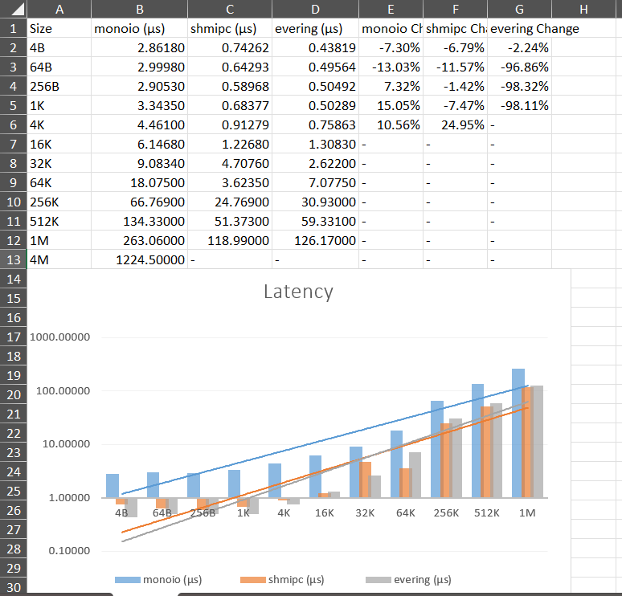

# Evering

**Evering** is a asynchronous communication frame driven by uring. Now it's only a **primitive** state.

## Road Map

- Better api.
- Ownership of Token to tackle early dropping.
- Recursive structure tokenize.

## Bench

The [bench](./bench/ipc-bench/) result is below:

## Contributing

Bug reports, contributions and forks are welcome. All bugs or other forms of discussion happen on [issues](https://github.com/lvyuemeng/Evering/issues).

## Note

It starts at OpenCamp-OS 2025s by [Zhang Chao(张超)](https://github.com/loichyan/openoscamp-2025s) trainee. Now we want to fully develop it as a independent project in a best wish.

## ⚖️ License

[Apache 2.0 license](./LICENSE-APACHE)
[MIT license](./LICENSE-MIT)